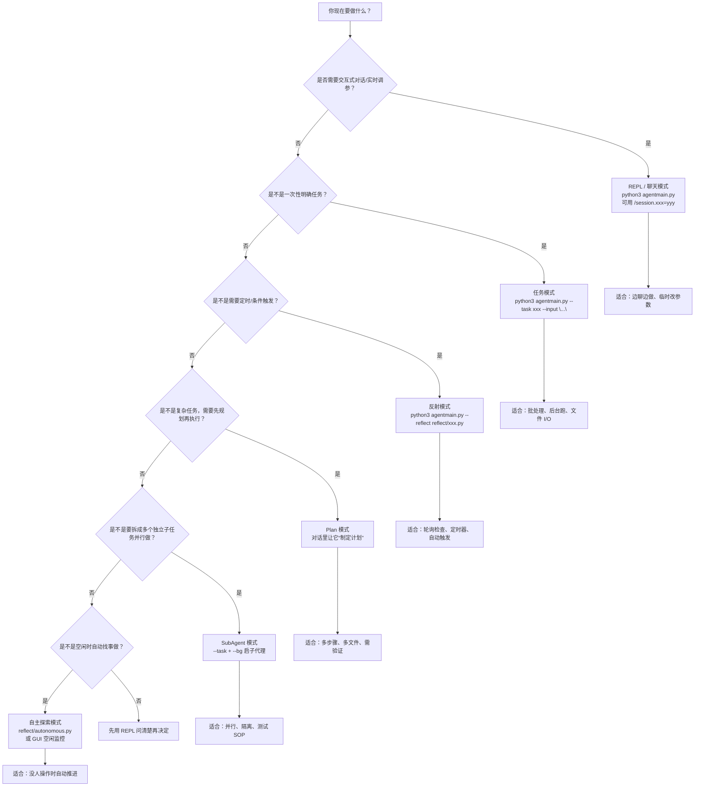

# GenericAgent 进阶使用指南

> 本文档覆盖 GA 的所有进阶功能，包括任务模式、反射模式、计划模式、子代理、自主探索、记忆系统、聊天平台接入等。

---



## 目录

1. [会话运行时调优](#1-会话运行时调优)
2. [Slash 命令](#2-slash-命令)
3. [任务模式 (--task)](#3-任务模式---task)
4. [反射模式 (--reflect)](#4-反射模式---reflect)
5. [计划模式 (Plan)](#5-计划模式-plan)
6. [子代理模式 (SubAgent)](#6-子代理模式-subagent)
7. [自主探索模式](#7-自主探索模式)
8. [MixinSession 故障转移](#8-mixinsession-故障转移)
9. [记忆系统 (L0-L4)](#9-记忆系统-l0-l4)
10. [技能系统](#10-技能系统)
11. [浏览器自动化](#11-浏览器自动化)
12. [聊天平台接入](#12-聊天平台接入)
13. [Hub 服务管理器](#13-hub-服务管理器)
14. [Langfuse 追踪](#14-langfuse-追踪)
15. [工具参考](#15-工具参考)
16. [LLM Session 类型](#16-llm-session-类型)

---

## 1. 会话运行时调优

在 REPL 中使用 `/session.xxx=yyy` 可实时修改当前 LLM 会话参数，立即生效，无需重启。

```bash
# 推理等级（Claude 侧写进 output_config.effort）
/session.reasoning_effort=high

# 思考模式：adaptive（模型自决）/ enabled / disabled
/session.thinking_type=adaptive

# 思考 token 预算（仅 thinking_type=enabled 时生效）
/session.thinking_budget_tokens=32768

# 采样温度
/session.temperature=0.3

# 最大输出 token 数
/session.max_tokens=16384

# 上下文窗口大小（历史裁剪阈值）
/session.context_win=80000

# 流式输出开关
/session.stream=false

# 连接/读取超时
/session.connect_timeout=10
/session.read_timeout=180
```

**支持的属性速查：**

| 属性 | 类型 | 说明 |
|------|------|------|
| `temperature` | float | 采样温度，默认 1.0 |
| `max_tokens` | int | 最大输出 token，默认 8192 |
| `context_win` | int | 上下文窗口，默认 28000 |
| `stream` | bool | 是否流式输出 |
| `reasoning_effort` | str | `none`/`minimal`/`low`/`medium`/`high`/`xhigh` |
| `thinking_type` | str | `adaptive`/`enabled`/`disabled` |
| `thinking_budget_tokens` | int | 思考 token 预算 |
| `max_retries` | int | 失败重试次数 |
| `connect_timeout` | int | 连接超时（秒） |
| `read_timeout` | int | 读取超时（秒） |

> 如果 yyy 是一个已存在的文件路径，会读取文件内容作为值。

---

## 2. Slash 命令

### REPL 模式（命令行）

| 命令 | 说明 |
|------|------|
| `/session.xxx=yyy` | 实时修改会话参数（见上节） |
| `/resume` | 从 `temp/model_responses/` 中恢复历史会话 |

### 前端模式（Streamlit / Qt / 桌面宠物等）

| 命令 | 说明 |
|------|------|
| `/help` | 显示帮助 |
| `/status` | 显示当前状态 |
| `/stop` | 停止当前任务 |
| `/new` | 新建对话，清空上下文 |
| `/restore` | 恢复上一次对话 |
| `/continue` | 列出可恢复的会话 |
| `/continue [n]` | 恢复第 N 个会话 |
| `/llm` | 列出可用 LLM 模型 |
| `/llm [n]` | 切换到第 N 个模型 |

---

## 3. 任务模式 (--task)

基于文件 I/O 的非交互模式，适合自动化集成。

### 基本用法

```bash
# 一次性任务（通过 --input 传入 prompt）
python3 agentmain.py --task my_task --input "帮我分析这段代码"

# 后台运行（打印 PID 后退出）
python3 agentmain.py --task my_task --input "帮我分析这段代码" --bg

# 指定 LLM
python3 agentmain.py --task my_task --input "..." --llm_no 1
```

### 文件交互协议

```
temp/{task_name}/
├── input.txt      # 输入 prompt（--input 自动写入）
├── output.txt     # 最终输出
├── output1.txt    # 中间结果（95% 概率写入）
├── output2.txt    # ...
├── reply.txt      # 写入此文件发送下一轮消息
└── _stop          # 写入此文件中断当前轮次
```

**多轮对话流程：**

1. 系统读取 `input.txt`，提交给 Agent
2. Agent 执行完毕，输出写入 `output.txt`，附加 `[ROUND END]` 标记
3. 等待 10 分钟，若 `reply.txt` 出现则继续下一轮
4. 若超时无 `reply.txt`，进程退出

---

## 4. 反射模式 (--reflect)

反射模式加载一个 Python 脚本，按固定间隔轮询，脚本可动态触发 Agent 任务。

### 启动

```bash
python3 agentmain.py --reflect reflect/autonomous.py
```

### 编写反射脚本

反射脚本需定义以下接口：

```python
INTERVAL = 300        # 轮询间隔（秒），默认 5
ONCE = False          # True = 触发一次后退出

def check():
    """
    每 INTERVAL 秒调用一次。
    返回 None 表示无操作，返回字符串则作为任务提交给 Agent。
    """
    # 示例：检查某个文件是否更新
    import os
    if os.path.exists('trigger.txt'):
        return '执行某个任务'
    return None

def on_done(result):
    """
    任务完成后的回调（可选）。
    result: Agent 的完整输出字符串。
    """
    print(f'任务完成: {result[:100]}')
```

### 内置反射脚本

| 脚本 | INTERVAL | 功能 |
|------|----------|------|
| `reflect/autonomous.py` | 1800 (30min) | 用户空闲时触发自主探索 |
| `reflect/scheduler.py` | 120 (2min) | 定时任务调度器 |

### 热重载

反射脚本修改后会自动重新加载，无需重启进程。

### 日志

结果自动记录到 `temp/reflect_logs/{脚本名}_{日期}.log`。

---

## 5. 计划模式 (Plan)

计划模式让 Agent 对复杂任务进行结构化规划、分步执行、验证。

### 进入计划模式

直接在 prompt 中要求 Agent 制定计划：

```
帮我制定一个计划，实现 XXX 功能
```

Agent 会调用 `do_enter_plan_mode` 进入计划模式（max_turns 提升到 100）。

### 五阶段工作流

```
Phase 1: 探索 → 委派子代理探测环境，写入探索结果
Phase 2: 规划 → 创建 plan.md，使用标记系统
Phase 3: 执行 → 逐项完成 plan.md 中的任务
Phase 4: 验证 → 子代理对抗性验证（PASS/FAIL/PARTIAL）
Phase 5: 失败处理 → 重试，子代理重启上限 2 次
```

### plan.md 标记系统

```markdown
- [D] 委派给子代理的任务
- [P] 可并行执行的任务（Map 模式）
- [?] 条件分支
- [ ] 待执行
- [x] 已完成
- [VERIFY] 验证步骤（必须存在）
```

### 自动行为

- 每 5 轮强制重读 `plan.md`
- 第 90 轮强制 `ask_user` 确认
- 所有 `[ ]` 完成后自动退出计划模式
- 无 VERDICT 时拦截完成声明

---

## 6. 子代理模式 (SubAgent)

子代理是独立的 OS 进程，通过文件系统与主代理通信。

### 启动方式

```bash
# 后台启动子代理
python3 agentmain.py --task {任务名} --input "任务描述" --bg --llm_no 0
```

### 通信协议

```
temp/{task_name}/
├── input.txt       # 主代理 → 子代理：任务输入
├── output.txt      # 子代理 → 主代理：输出结果（[ROUND END] 标记完成）
├── output1.txt     # 输出文件循环
├── reply.txt       # 主代理 → 子代理：后续消息
├── _stop           # 主代理写入：中断当前轮次
├── _keyinfo        # 主代理写入：注入工作记忆
└── _intervene      # 主代理写入：追加指令到下次 prompt
```

### 两种使用模式

**测试模式**：观察子代理自主行为，验证 SOP 质量

```
启动子代理 → 监控 output.txt → 分析行为
```

**Map 模式**：分配 N 个独立子任务给 N 个子代理并行执行

```
子任务1 → 子代理A
子任务2 → 子代理B  （并行）
子任务3 → 子代理C
```

### 主代理监控要点

- 主动读取 `output.txt`，不要 sleep 轮询
- 使用干预文件（`_stop`/`_keyinfo`/`_intervene`）纠偏
- 子代理超时 10 分钟无 `reply.txt` 自动退出

---

## 7. 自主探索模式

空闲 30 分钟后自动触发，Agent 自主规划并执行有价值的任务。

### 触发方式

- **自动**：`launch.pyw` 的 `idle_monitor` 检测 30 分钟无活动后注入任务
- **手动**：`python3 agentmain.py --reflect reflect/autonomous.py`
- **对话中**：直接告诉 Agent "进入自主探索模式"

### 工作流程

1. **检查 TODO**：读取 `TODO.txt`，有未完成任务则执行
2. **任务规划**：分析历史记录，生成 5-7 个 TODO，子代理评审打分
3. **执行**：选择一个 TODO，30 轮内完成，写报告到 `autonomous_reports/`
4. **归档**：`complete_task()` 自动编号、移动报告、追加历史

### 任务选择公式

```
价值 = 失败概率(不做此事) × 持续收益(对未来协作)
```

优先级：能力树扩展 > 环境发现 > 个性化定制 > 通用探索

### 权限边界

| 操作 | 权限 |
|------|------|
| 只读探测 | 自由执行 |
| 修改 global_mem/SOP | 需写报告待审核 |
| 读取密钥文件 | 禁止 |
| 修改核心代码 | 禁止 |

---

## 8. MixinSession 故障转移

多个 LLM 后端自动故障转移，支持指数退避和自动回弹。

### 配置

```python
# mykey.py
mixin_config = {
    'llm_nos': ['cc-relay-1', 'gpt-native'],  # 按优先级排列
    'max_retries': 10,           # 整个 rotation 的总重试上限
    'base_delay': 0.5,           # 指数退避起始延迟（秒）
    'spring_back': 300,          # 切到备用后多久尝试回到主节点（秒）
}
```

### 行为

- **轮转**：出错时切换到下一个后端，全轮失败后指数退避（`min(30, base_delay * 1.5^round)`）
- **回弹**：切换到备用后，`spring_back` 秒后自动尝试回到主节点
- **流中断检测**：流异常中断时下一次调用自动切换到备用
- **属性广播**：设置 `temperature`/`max_tokens` 等会传播到所有后端
- **约束**：所有 session 必须同类型（全 Native 或全非 Native）

---

## 9. 记忆系统 (L0-L4)

### 架构

```
L0: memory_management_sop.md     ← 元规则（加载到 system prompt）
 │
L1: global_mem_insight.txt       ← 索引（≤30 行，<1K tokens）
 │
L2: global_mem.txt               ← 稳定环境事实
 │
L3: memory/*.md, memory/*.py     ← 任务 SOP 和脚本
 │
L4: L4_raw_sessions/             ← 归档的会话日志
```

### L0 元规则（宪法）

1. 修改源码前必须询问用户
2. 做决策前先检查记忆
3. 逐步执行
4. 不读取密钥文件
5. 记忆编辑只用 patch（不覆盖）

### L1 索引

`memory/global_mem_insight.txt`，严格 ≤30 行：
- 高频场景 key→value 映射（如 `tmwebdriver_sop(httponly cookie)`）
- 低频项目只保留关键词
- RULES 区域：红线规则 + 高频错误点

### L2 全局事实

`memory/global_mem.txt`，按 `## [SECTION]` 组织，存储环境特定的事实（路径、配置等）。

### L3 任务记录

`memory/` 目录下的 SOP 和脚本，包括：

| 文件 | 用途 |
|------|------|
| `plan_sop.md` | 计划模式 SOP |
| `subagent.md` | 子代理协议 |
| `verify_sop.md` | 验证 SOP |
| `autonomous_operation_sop.md` | 自主探索 SOP |
| `scheduled_task_sop.md` | 定时任务 SOP |
| `memory_management_sop.md` | 记忆管理 SOP |
| `web_setup_sop.md` | Web 工具配置 SOP |
| `tmwebdriver_sop.md` | 浏览器自动化 SOP |
| `vision_sop.md` | 视觉能力 SOP |
| `adb_ui.py` | Android UI 自动化 |
| `ocr_utils.py` | OCR 工具 |

### L4 会话归档

`scheduler.py` 每 12 小时自动触发 `memory/L4_raw_sessions/compress_session.py`：
- 批量压缩 `model_responses_*.txt`
- 提取 `[USER]/[Agent]` 历史块
- 按月归档为 ZIP
- 追加到 `all_histories.txt`

### 工作记忆

`update_working_checkpoint` 工具存储 `key_info` 和 `related_sop`，每轮注入到 prompt 中，跨工具调用保持。

### 主动记忆更新

15+ 轮的任务完成后，Agent 自动触发 `start_long_term_update`，将已验证的经验提炼到 L2/L3。

---

## 10. 技能系统

GenericAgent 不预设技能，靠使用进化。

### 进化机制

1. **任务完成** → `start_long_term_update` 将经验写入 L3 SOP
2. **SOP 复用** → 下次遇到类似任务直接调用已有 SOP
3. **脚本工具** → `memory/*.py` 自动加入 `sys.path`，可在 `code_run` 中直接 import
4. **技能搜索** → `memory/skill_search/` 提供 105K+ 技能卡片的语义搜索

### 使用技能

```
帮我找个做 XXX 的 skill          → Agent 搜索技能库
按照 memory/xxx_sop.md 做 XXX   → 直接指定 SOP
把这个记到你的记忆里              → 手动触发记忆保存
```

---

## 11. 浏览器自动化

TMWebDriver 通过 WebSocket + HTTP 长轮询与浏览器通信。

### 配置

对 Agent 说：`执行 web setup sop，解锁 web 工具`

Agent 会自动注入 Chrome 扩展，配置 WebSocket 服务。

### 架构

```
Chrome 扩展 (assets/tmwd_cdp_bridge/)
    ↕ WebSocket (port 18765)
TMWebDriver.py
    ↕ HTTP (port 18766)
GA web_scan / web_execute_js 工具
```

### 可用工具

| 工具 | 功能 |
|------|------|
| `web_scan` | 获取简化 HTML + 标签列表，支持 `text_only`、`tabs_only` |
| `web_execute_js` | 执行 JavaScript，支持 `save_to_file`、`no_monitor` |

### 使用示例

```
打开淘宝，搜索 iPhone 16，按价格排序
去 B 站，查看我最近看过的历史视频
帮我登录 XXX 网站，执行 XXX 操作
```

---

## 12. 聊天平台接入

在 `mykey.py` 中配置对应平台的凭证，启动时自动连接。

### 支持的平台

| 平台 | 配置项 | 启动参数 |
|------|--------|----------|
| Telegram | `tg_bot_token`, `tg_allowed_users` | `--tg` |
| QQ | `qq_app_id`, `qq_app_secret`, `qq_allowed_users` | `--qq` |
| 飞书 | `fs_app_id`, `fs_app_secret`, `fs_allowed_users` | `--feishu` |
| 企业微信 | `wecom_bot_id`, `wecom_secret`, `wecom_allowed_users` | `--wecom` |
| 钉钉 | `dingtalk_client_id`, `dingtalk_client_secret`, `dingtalk_allowed_users` | `--dingtalk` |
| 微信 | 首次扫码登录，token 存 `~/.wxbot/token.json` | 自动 |

### 配置示例

```python
# mykey.py
tg_bot_token = '84102K2gYZ...'
tg_allowed_users = [6806...]    # 留空或 ['*'] 允许所有用户

qq_app_id = '123456789'
qq_app_secret = 'xxxxxxxxxxxxxxxx'
qq_allowed_users = ['your_user_openid']
```

### 启动

```bash
# 启动 Streamlit + Telegram bot
python3 launch.pyw --tg

# 启动多个平台
python3 launch.pyw --tg --qq --sched

# 通过 Hub 管理
python3 hub.pyw
```

---

## 13. Hub 服务管理器

`hub.pyw` 是一个 tkinter 图形界面，用于集中管理所有服务。

### 启动

```bash
python3 hub.pyw
```

### 功能

- **服务发现**：自动扫描 `reflect/` 和 `frontends/` 目录
- **启停控制**：勾选/取消勾选启动/停止服务
- **输出查看**：显示选中服务的最近 200 行 stdout
- **热扫描**：Rescan 按钮重新发现服务，不影响运行中的服务
- **单例保证**：端口 19735 锁定，防止重复启动

---

## 14. Langfuse 追踪

可选的 LLM 调用追踪插件。

### 配置

```python
# mykey.py
langfuse_config = {
    'public_key': 'pk-lf-...',
    'secret_key': 'sk-lf-...',
    'host': 'https://cloud.langfuse.com',  # 或自托管地址
}
```

配置后自动激活，无需其他操作。

### 追踪层级

```
agent.task          ← 整个任务
├── llm.chat        ← 每次 LLM 调用（含 token 用量）
│   ├── tool.code_run
│   ├── tool.file_read
│   └── tool.web_scan
└── llm.chat
```

---

## 15. 工具参考

Agent 可用的所有工具：

| 工具 | 参数 | 说明 |
|------|------|------|
| `code_run` | `script`, `type`, `timeout`, `cwd`, `inline_eval` | 执行 Python/bash 代码 |
| `file_read` | `path`, `start`, `count`, `keyword`, `show_linenos` | 读取文件，支持行号、关键词搜索 |
| `file_patch` | `path`, `old_content`, `new_content` | 精确查找替换 |
| `file_write` | `path`, `mode` (overwrite/append/prepend) | 写入文件 |
| `web_scan` | `tabs_only`, `switch_tab_id`, `text_only` | 获取浏览器页面简化 HTML |
| `web_execute_js` | `script`, `save_to_file`, `no_monitor`, `switch_tab_id` | 执行浏览器 JavaScript |
| `update_working_checkpoint` | `key_info`, `related_sop` | 更新短期工作记忆 |
| `ask_user` | `question`, `candidates` | 中断任务，向用户提问 |
| `start_long_term_update` | (无) | 触发长期记忆蒸馏 |

### code_run 说明

Python 脚本执行前会自动注入 `assets/code_run_header.py`：
- 将 `memory/` 加入 `sys.path`（可直接 import 记忆中的脚本）
- Windows 下修补 subprocess 编码和隐藏窗口
- ImportError/AttributeError 时提示 "NO GUESSING! You MUST probe first"

---

## 16. LLM Session 类型

### 变量名 → Session 类型映射

| 变量名包含 | Session 类 | 工具协议 |
|-----------|-----------|---------|
| `native` + `claude` | NativeClaudeSession | API 原生 tool 字段 |
| `native` + `oai` | NativeOAISession | API 原生 tool 字段 |
| `claude`（不含 native） | ClaudeSession | 文本协议 `<tool_use>` |
| `oai`（不含 native） | LLMSession | 文本协议 `<tool_use>` |
| `mixin` | MixinSession | 多后端故障转移 |

### Native vs 非 Native

- **Native**：工具定义放在 API 的 `tools` 字段（function calling），对 Claude Code / Codex 类模型效果最好
- **非 Native**：工具描述放在 text 字段（文本协议），兼容性更广但对 overfit 模型效果打折

### Prompt Cache

- NativeClaudeSession 恒开 prompt-caching-scope beta，缓存默认拉满
- LLMSession / NativeOAISession 在 model 名含 `claude`/`anthropic` 时自动在最后两条 user 打 `cache_control: ephemeral`
- `prompt_cache` 字段默认 True，仅在上游 relay 不认 cache_control 时需设 False

---

## 附录：常用启动命令

```bash
# 命令行交互模式
python3 agentmain.py

# 带 verbose 输出
python3 agentmain.py --verbose

# 图形界面
python3 launch.pyw

# 图形界面 + 聊天平台
python3 launch.pyw --tg --sched

# 一次性任务
python3 agentmain.py --task mytask --input "做某件事"

# 后台任务
python3 agentmain.py --task mytask --input "做某件事" --bg

# 反射模式
python3 agentmain.py --reflect reflect/autonomous.py

# Hub 服务管理
python3 hub.pyw
```
